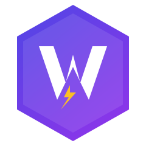

<div align="center">



# KMP WorkManager

[](https://central.sonatype.com/artifact/dev.brewkits/kmpworkmanager)
[](https://kotlinlang.org)
[](https://github.com/brewkits/kmpworkmanager/actions/workflows/build.yml)
[](LICENSE)

**Background task scheduling for Kotlin Multiplatform — including the parts iOS makes hard.**

</div>

---

## Installation

```kotlin
// build.gradle.kts
commonMain.dependencies {
    implementation("dev.brewkits:kmpworkmanager:2.4.1")
}
```

<details>
<summary><b>Android setup</b></summary>

```kotlin
class MyApplication : Application() {
    override fun onCreate() {
        super.onCreate()
        KmpWorkManager.initialize(this)
    }
}
```

</details>

<details>
<summary><b>iOS setup</b></summary>

**1. Worker factory** (`iosMain`):

```kotlin
class AppWorkerFactory : IosWorkerFactory {
    override fun createWorker(workerClassName: String): IosWorker? = when (workerClassName) {
        "SyncWorker"   -> SyncWorkerIos()
        "UploadWorker" -> UploadWorkerIos()
        else           -> null
    }
}
```

**2. AppDelegate**:

```swift
@main
class AppDelegate: UIResponder, UIApplicationDelegate {

    override init() {
        super.init()
        KoinInitializerKt.doInitKoin(platformModule: IOSModuleKt.iosModule)
    }

    func application(_ application: UIApplication,
                     didFinishLaunchingWithOptions launchOptions: [UIApplication.LaunchOptionsKey: Any]?) -> Bool {
        let koin = KoinIOS()
        
        BGTaskScheduler.shared.register(
            forTaskWithIdentifier: "kmp_chain_executor_task",
            using: nil
        ) { task in
            IosBackgroundTaskHandler.shared.handleChainExecutorTask(
                task: task,
                chainExecutor: koin.getChainExecutor()
            )
        }
        return true
    }
}
```

**3. `Info.plist`**:

```xml
<key>BGTaskSchedulerPermittedIdentifiers</key>
<array>
    <string>kmp_chain_executor_task</string>
</array>
```

Full setup: [docs/platform-setup.md](docs/platform-setup.md)

</details>

---

## Quick start

### Schedule a task

```kotlin
// One-time — runs as soon as constraints are met
scheduler.enqueue(
    id              = "nightly-sync",
    trigger         = TaskTrigger.OneTime(initialDelayMs = 0),
    workerClassName = "SyncWorker",
    constraints     = Constraints(requiresNetwork = true)
)

// Periodic — every 15 minutes
scheduler.enqueue(
    id              = "heartbeat",
    trigger         = TaskTrigger.Periodic(intervalMs = 15 * 60 * 1000L),
    workerClassName = "SyncWorker"
)
```

### Define a worker

```kotlin
// commonMain — shared logic
class SyncWorker : Worker {
    override suspend fun doWork(input: String?, env: WorkerEnvironment): WorkerResult {
        val items = api.fetchPendingItems()
        database.upsert(items)
        return WorkerResult.Success(
            message = "Synced ${items.size} items",
            data    = mapOf("count" to items.size)
        )
    }
}
```

```kotlin
// androidMain
class SyncWorkerAndroid : AndroidWorker {
    override suspend fun doWork(input: String?, env: WorkerEnvironment) =
        SyncWorker().doWork(input, env)
}

// iosMain
class SyncWorkerIos : IosWorker {
    override suspend fun doWork(input: String?, env: WorkerEnvironment) =
        SyncWorker().doWork(input, env)
}
```

### Chain tasks

```kotlin
// Multi-step workflows that survive process death.
// If step 47 of 100 was running when iOS killed the app —
// the next BGTask invocation resumes at step 47, not step 0.
scheduler.beginWith(TaskRequest("DownloadWorker", inputJson = """{"url":"$fileUrl"}"""))
    .then(TaskRequest("ValidateWorker"))
    .then(TaskRequest("TranscodeWorker"))
    .then(TaskRequest("UploadWorker", inputJson = """{"bucket":"processed"}"""))
    .withId("transcode-pipeline", policy = ExistingPolicy.KEEP)
    .enqueue()
```

---

## Why KMP WorkManager?

Most KMP libraries wrap the happy path — iOS BGTaskScheduler is not just "a different API."
It has a credit system that punishes apps overrunning their time budget, an opaque scheduling policy,
and no recovery mechanism for incomplete work. Getting it wrong means your tasks silently stop running.

| | Android | iOS |
|---|---------|-----|
| Scheduling | Deterministic via WorkManager | Opportunistic — OS decides when |
| Exact timing | ✅ AlarmManager | ⚠️ Best-effort |
| Chain recovery | ✅ WorkContinuation | ✅ Step-level persistence |
| Time budget enforcement | — | ✅ Adaptive (reserves 15–30% safety margin) |
| Queue integrity | ✅ | ✅ CRC32-verified binary format |
| Thread-safe expiry | ✅ | ✅ AtomicInt shutdown flag |

---

## Triggers

| Trigger | Android | iOS | Notes |
|---------|---------|-----|-------|
| `OneTime(delayMs)` | WorkManager | BGTaskScheduler | Minimum delay may be enforced by OS |
| `Periodic(intervalMs)` | WorkManager | BGTaskScheduler | Min 15 min on both platforms |
| `Exact(epochMs)` | AlarmManager | Best-effort | iOS cannot guarantee exact timing |
| `Windowed(earliest, latest)` | WorkManager with delay | BGTaskScheduler | Preferred over Exact on iOS |
| `ContentUri(uri)` | WorkManager ContentUriTrigger | — | Android only |

---

## What's new in v2.4.1

### iOS Dynamic Task IDs (no more Info.plist for every task)

Previously, every task ID had to be declared in `BGTaskSchedulerPermittedIdentifiers` before scheduling. v2.4.1 removes that constraint: only the single master dispatcher ID needs to be in `Info.plist`. All other task IDs are routed through an internal `AppendOnlyQueue` and executed when the OS fires the master dispatcher slot.

```kotlin
// This ID does NOT need to be in Info.plist
scheduler.enqueue(
    id = "user-${userId}-daily-sync",   // dynamic, per-user ID
    trigger = TaskTrigger.Periodic(intervalMs = 24 * 60 * 60 * 1000),
    workerClassName = "DailySyncWorker"
)
```

```xml
<!-- Info.plist — only one entry needed for all dynamic tasks -->
<key>BGTaskSchedulerPermittedIdentifiers</key>
<array>
    <string>kmp_master_dispatcher_task</string>
    <string>kmp_chain_executor_task</string>
</array>
```

### Periodic Task Improvements
Added granular control over the first execution of periodic tasks. You can now defer the initial run or set a specific delay, ensuring your app doesn't choke on heavy sync tasks immediately upon startup.

```kotlin
// Run every 1 hour, but defer the very first run by 1 hour
TaskTrigger.Periodic(
    intervalMs = 3600_000,
    runImmediately = false
)
```

### Swift Interop 2.0
iOS developers can now use idiomatic `Double` (seconds) instead of `Long` (milliseconds) for all triggers, making the API feel native to the Apple ecosystem.

```swift
// Swift
let trigger = createTaskTriggerPeriodicSeconds(
    intervalSeconds: 3600, 
    initialDelaySeconds: 600
)
```

### iOS Native Background Task Handler
The host application no longer needs to copy and maintain 150+ lines of Swift boilerplate to handle iOS background tasks. The library now provides a native Kotlin API that handles the entire lifecycle:

```swift
// AppDelegate.swift — now just 3 lines to handle any task
BGTaskScheduler.shared.register(forTaskWithIdentifier: taskId, using: nil) { task in
    IosBackgroundTaskHandler.shared.handleSingleTask(
        task: task,
        scheduler: koin.getScheduler(),
        executor: koin.getExecutor()
    )
}
```

This handler automatically:
- Sets up the `expirationHandler` for graceful shutdown.
- Resolves worker metadata (`workerClassName`, `inputJson`) from file storage.
- Executes the worker with timeout protection via `SingleTaskExecutor`.
- **Auto-reschedules periodic tasks** and the chain executor if the queue is not empty.
- Performs deadline checks for windowed tasks.

### Execution history (v2.3.8)
Every chain execution is persisted locally. Collect, upload, clear:

```kotlin
lifecycleScope.launch {
    val records = scheduler.getExecutionHistory(limit = 200)
    if (records.isNotEmpty()) {
        analyticsService.uploadBatch(records)
        scheduler.clearExecutionHistory()
    }
}
```

Each `ExecutionRecord` carries `chainId`, `status` (SUCCESS / FAILURE / ABANDONED / SKIPPED / TIMEOUT), `durationMs`, step counts, error message, retry count, and platform. Up to 500 records kept; older ones pruned automatically.

### Telemetry hook
Route task lifecycle events to Sentry, Crashlytics, or Datadog:

```kotlin
KmpWorkManagerConfig(
    telemetryHook = object : TelemetryHook {
        override fun onTaskFailed(event: TelemetryHook.TaskFailedEvent) {
            Sentry.captureMessage("Task failed: ${event.taskName} — ${event.error}")
        }
        override fun onChainFailed(event: TelemetryHook.ChainFailedEvent) {
            analytics.track("chain_failed", mapOf(
                "chainId"   to event.chainId,
                "failedStep" to event.failedStep
            ))
        }
    }
)
```

Six events: `onTaskStarted`, `onTaskCompleted`, `onTaskFailed`, `onChainCompleted`, `onChainFailed`, `onChainSkipped`. All have default no-op implementations.

### Task priority
`LOW`, `NORMAL`, `HIGH`, `CRITICAL`. On Android, `HIGH`/`CRITICAL` map to expedited work. On iOS, the queue is sorted by priority before each BGTask window:

```kotlin
scheduler.beginWith(
    TaskRequest(workerClassName = "PaymentSyncWorker", priority = TaskPriority.CRITICAL)
).enqueue()
```

### Battery guard
```kotlin
KmpWorkManagerConfig(minBatteryLevelPercent = 10) // defer when < 10% and not charging
```
Default `5%`. Works on both platforms.

### KSP: BGTask ID validation

```kotlin
// iosMain
@Worker("SyncWorker", bgTaskId = "com.example.sync-task")
class SyncWorker : IosWorker { ... }

// kmpWorkerModule() automatically validates bgTaskId against Info.plist at startup
kmpWorkerModule(workerFactory = IosWorkerFactoryGenerated())
```

Add to `build.gradle.kts`:
```kotlin
plugins { id("com.google.devtools.ksp") }

dependencies {
    ksp("dev.brewkits:kmpworker-ksp:2.4.1")
    commonMain.implementation("dev.brewkits:kmpworker-annotations:2.4.1")
}
```

---

## Built-in workers

| Worker | Purpose |
|--------|---------|
| `HttpRequestWorker` | HTTP request with configurable method, headers, body |
| `HttpDownloadWorker` | Resumable file download to local storage |
| `HttpUploadWorker` | Multipart file upload |
| `HttpSyncWorker` | Fetch-and-persist data sync |
| `FileCompressionWorker` | File compression (Android: built-in · iOS: requires ZIPFoundation) |

---

## Security

**SSRF protection** — all built-in worker HTTP calls are validated before dispatch. Blocked:

```
169.254.169.254   AWS/GCP/Azure IMDS
fd00:ec2::254     AWS EC2 (IPv6)
100.100.100.200   Alibaba Cloud metadata
localhost, 0.0.0.0, [::1], 10.x, 172.16–31.x, 192.168.x
```

RFC 3986 UserInfo bypass and multi-`@` authority attacks are both handled. DNS rebinding is a known limitation — use certificate pinning or an egress proxy for high-trust environments.

**Input size validation** — inputs exceeding WorkManager's 10 KB `Data` limit throw `IllegalArgumentException` at enqueue time.

---

## Testing

```
600+ tests across commonTest, iosTest, androidInstrumentedTest
```

- `QA_PersistenceResilienceTest` — 100-step chain killed at step 50, resumes at exactly step 50
- `V236ChainExecutorTest` — time budget, shutdown propagation, batch loop correctness
- `IosExecutionHistoryStoreTest` — save/get/clear, auto-pruning, all status variants
- `AppendOnlyQueueTest` — CRC32 corruption detection, truncation recovery, concurrent access
- `SecurityValidatorTest` — SSRF, IPv6 compressed loopback, multi-`@` UserInfo bypass

---

## Documentation

| | |
|---|---|
| [Quick Start](docs/quickstart.md) | Running in 5 minutes |
| [Platform Setup](docs/platform-setup.md) | Android & iOS configuration |
| [API Reference](docs/api-reference.md) | Full public API |
| [Task Chains](docs/task-chains.md) | Chain API and recovery semantics |
| [Built-in Workers](docs/BUILTIN_WORKERS_GUIDE.md) | Worker reference and input schema |
| [Constraints & Triggers](docs/constraints-triggers.md) | All scheduling options |
| [iOS Best Practices](docs/ios-best-practices.md) | BGTask gotchas and recommendations |
| [Troubleshooting](docs/TROUBLESHOOTING.md) | Common issues |
| [CHANGELOG](CHANGELOG.md) | Release history |

**Migration:** [v2.2.2 → v2.3.0](docs/MIGRATION_V2.3.0.md) · [v2.3.3 → v2.3.4](docs/MIGRATION_V2.3.3_TO_V2.3.4.md)

---

## Requirements

| | |
|---|---|
| Kotlin | 2.1.0+ |
| Android | 8.0+ (API 26) |
| iOS | 13.0+ |
| Gradle | 8.0+ |

---

## Contributing

```bash
./gradlew :kmpworker:allTests   # all platforms must pass before opening a PR
```

Commit messages follow [Conventional Commits](https://www.conventionalcommits.org/).

---

## License

Apache 2.0. See [LICENSE](LICENSE).

---

<div align="center">

[GitHub](https://github.com/brewkits/kmpworkmanager) · [Maven Central](https://central.sonatype.com/artifact/dev.brewkits/kmpworkmanager) · [Issues](https://github.com/brewkits/kmpworkmanager/issues)

</div>
