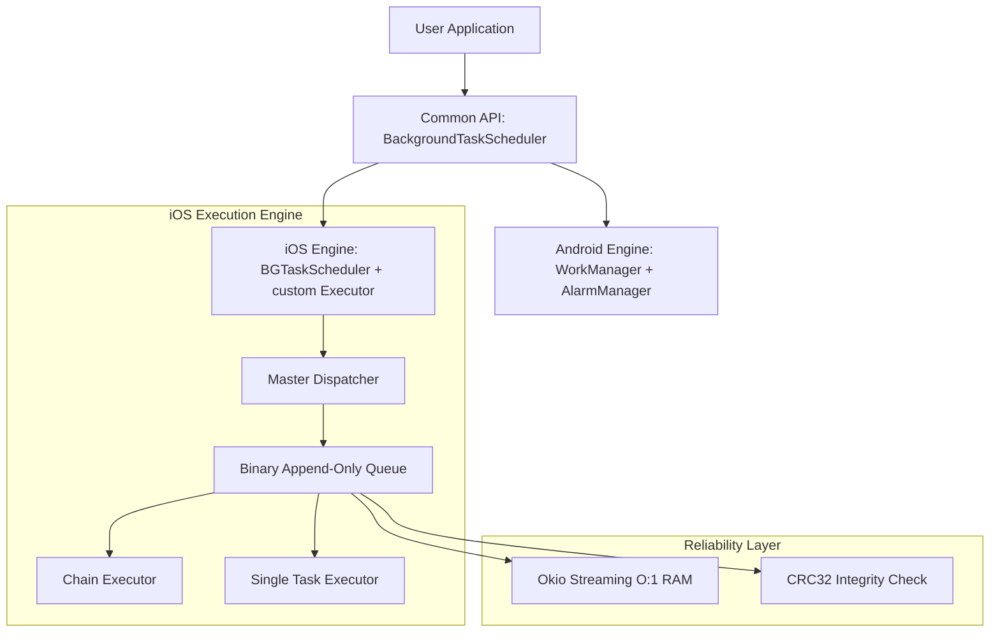

# 🏗️ KMP WorkManager Architecture

This document provides a technical deep dive into the design and implementation of KMP WorkManager. It explains how we bridge the gap between Android's process-based backgrounding and iOS's task-based opportunistic scheduling.

## 📐 High-Level Architecture

KMP WorkManager is built on a layered architecture that prioritizes **Clean Boundaries** and **Platform Integrity**.

---

## 🧵 Concurrency & Threading Model

Background work is inherently concurrent. We follow a strict threading policy to ensure zero hangs on the Main thread.

### 1. Threading Policy
- **Android**: All scheduling calls (`enqueue`) are dispatched to `Dispatchers.Default`. The actual work runs on WorkManager's worker pool.
- **iOS**: 
    - **Scheduling**: Offloaded to a dedicated GCD-backed `IosDispatchers.IO`. 
    - **Execution**: Workers run within a `Managed Scope`. If the OS expiration handler fires, we use an `AtomicInt` flag and `Job.cancel()` to ensure a sub-second graceful shutdown.

### 2. Thread Safety
We use a **Double-Locking & Mutex** strategy for the iOS `AppendOnlyQueue`:
- `queueMutex`: Protects the physical file write operations.
- `progressMutex`: Independent lock for tracking step-level completion in chains, preventing deadlocks when a worker tries to update progress while the queue is being drained.

---

## 🍎 iOS Execution Engine: The "Master Dispatcher" Pattern

iOS's `BGTaskScheduler` normally requires every task ID to be hardcoded in `Info.plist`. To support **Dynamic Task IDs**, we developed a proprietary dispatching system.

### 1. The Append-Only Binary Queue
- **Integrity**: Every record is prefixed with a CRC32 checksum.
- **Resilience**: If the app is killed during a write, the system detects the corruption point and truncates the file to the last known-good state.
- **O(1) Memory**: (v2.4.2) Powered by **Okio**. Peak RAM remains constant regardless of queue size.

---

## 🛡️ Failure Recovery Matrix (Resilience)

| Event | System Behavior | Recovery Action |
| :--- | :--- | :--- |
| **Process Death** | Immediate kill by OS. | Current step status is saved. Next wake-up resumes from exactly that step. |
| **Queue Corruption**| Binary file parity mismatch. | System identifies the CRC32 failure point and truncates the file to preserve history. |
| **Disk Full** | `IOException` on write. | Scheduling returns `REJECTED_OS_POLICY`. Library enters "Safety Mode" to prevent crashes. |
| **iOS Expiration** | System calls `expirationHandler`. | `ChainExecutor` stops current worker, flushes all pending progress, and marks task for immediate resume. |

---

## 🤖 Android Subsystem: WorkManager Integration

### 1. Immediate Execution Logic
Android's `PeriodicWorkRequest` has a minimum interval of 15 minutes. To support "immediate" first-runs, we dynamically calculate the `flexMs` and `initialDelay` to satisfy WorkManager's internal scheduling window while ensuring the task starts as soon as possible.

---

## 📡 Observability & Telemetry

- **EventBus**: Powered by `SharedFlow` (replay=0, buffer=64). Decoupled UI monitoring.
- **Telemetry Hook**: Pluggable interface for production monitoring (Sentry, Crashlytics). We route internal errors (e.g., migration failures) through this hook.

---

**Last Updated:** April 2026
**Version:** 2.4.2
